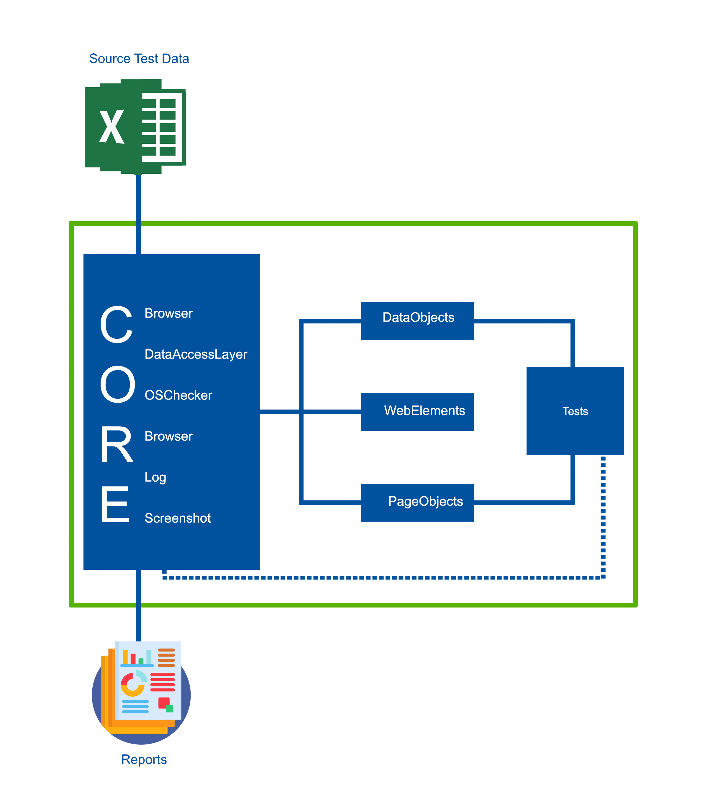

# test-automation-framework

This was created using Java programming languages. The test automation API/library used for this 
is Selenium WebDriver-Java. The Automation framework tool used is mainly TestNG, but JUnit was also used for assertions. The Project Management Tool used for downloading, updating and importing depedencies/libraries is Maven.

### Hybrid Testing Framework

The Test Automation Framework applied This called Hybrid Test Framework.

It is a combination of any various frameworks set up to leverage the advantages of some and mitigate the weaknesses of others. 

As the concept implicates, it leverages the benefits of all the test frameworks.

Frameworks applied are:
- Module Based Testing Framework
- Library Architecture Testing Framework
- Data Driven Testing Framework

### Framework Structure

### Execution

Tests can be executed via maven command:

 - mvn clean test -DsuiteXmlFile="xmlfile.xml" -Denvironment="<environment>" -DbrowserInstance="<browserName>"
   - e.g.:
     - *mvn clean test -DsuiteXmlFile="SmokeTesting.xml" -Denvironment="test" -DbrowserInstance="chrome"*